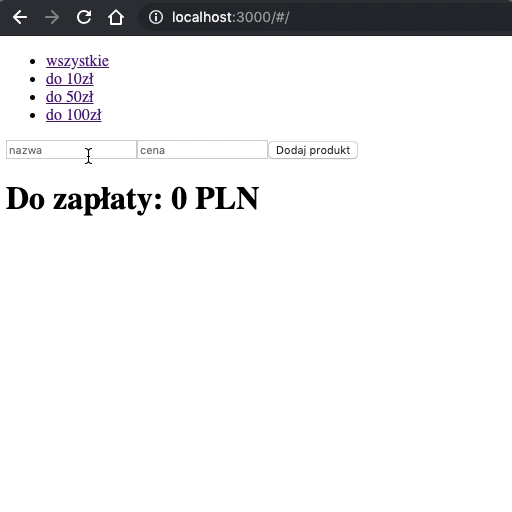

## Zadanie do samodzielnego wykonania

Zaimplementuj aplikację, w której użytkownik będzie mógł dodawać produkty do koszyka.

Każdy produkt powinien być opisany przez nazwę i cenę.

Produkty można dodawać poprzez prosty formularz (2 inputy + przycisk (Dodaj produkt)).

Dodane produkty powinny wyświetlać się w formie listy wypunktowanej. Przy każdym produkcie powinien znajdować się przycisk `Usuń`, który usuwa produkt z koszyka.

Na dole aplikacji powinna wyświetlać się suma do zapłaty w formie znacznika `<h1>` np.:

```html
<h1>Do zapłaty: 20 PLN</h1>
```

Na górze aplikacji powinny znaleźć się 4 linki nawigacyjne. Po kliknięciu w link użytkownik powinien widzieć na liście tylko te produkty, które spełniają założenia filtra.

Linki do filtrów:

- wszystkie
- do 10zł
- do 50zł
- do 100zł

Zaprojektuj:
* store
* akcje
* komponent kontenerowy 

Do filtrowania skorzystaj z selektora, do którego przekażesz parametr URL.
Na jego podstawie powinien zostać obliczony efekt filtrowania.

Reducer powinien przechowywać tylko listę produktów w formie tablicy.

Komponenty prezentacyjne są już gotowe. Wystarczy dodać do nich wywołania akcji Reduxa.

### Przykład

