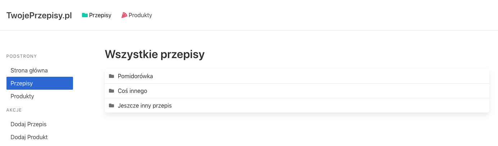
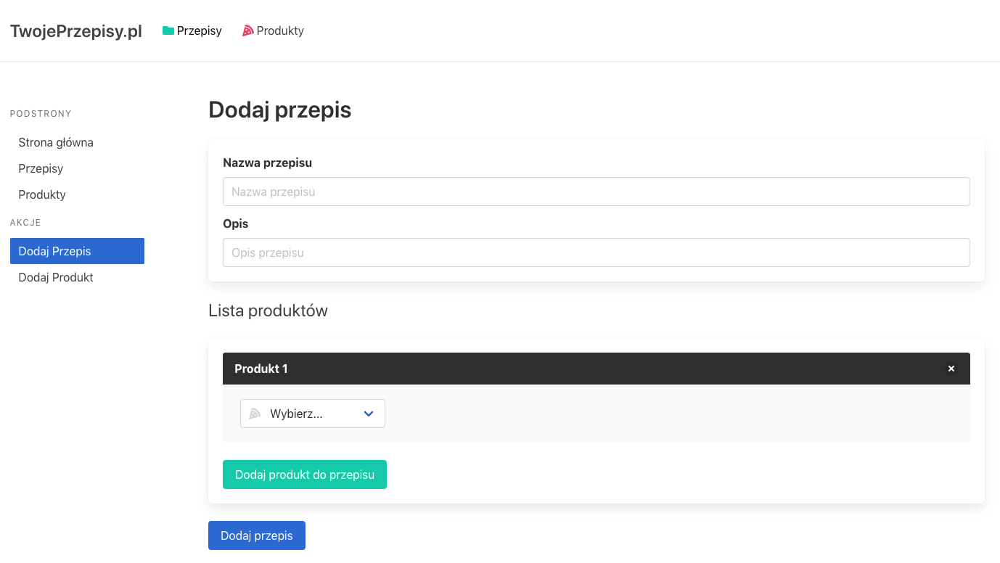
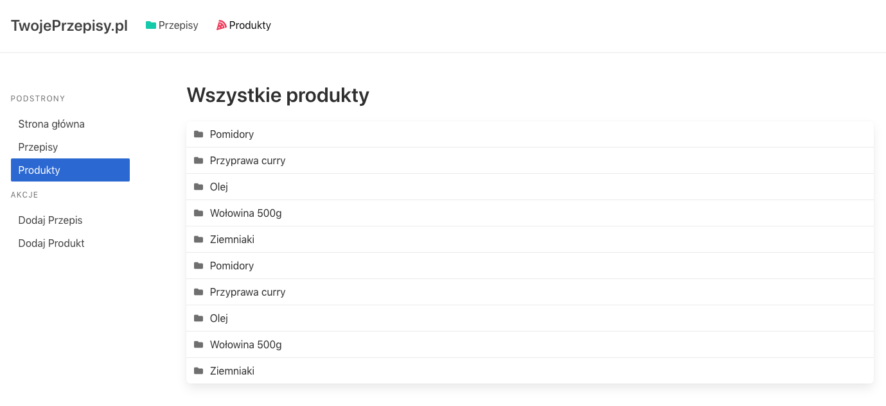
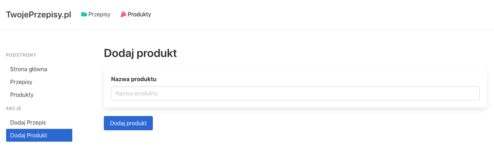
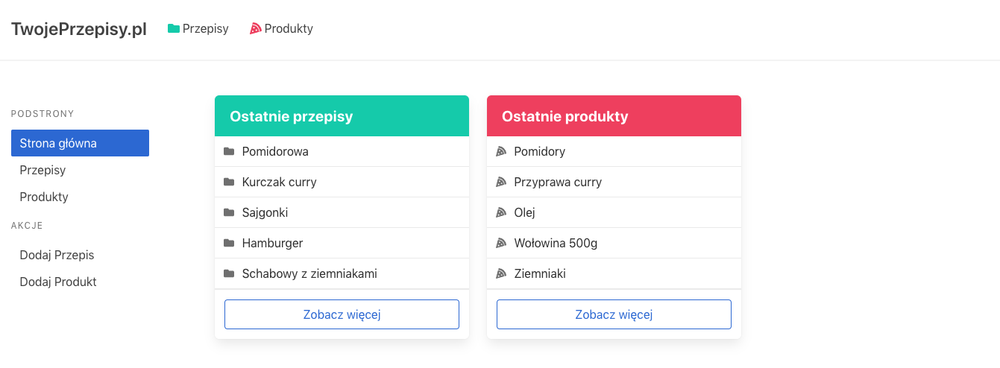

## Zadanie

### Przygotowanie

> Zainstaluj paczkę `prop-types`. Następnie w pliku `User.js` zaimplementuj komponent, który będzie wyświetlał informacje o użytkowniku.

Zaimplementuj aplikację składającą się z 2 podstawowych typów danych:

### Przepisy



- `/recipes` - wyświetlamy wszystkie dostępne przepisy w naszym `store`. Każdy przepis kieruje do miejsca w którym możemy podejrzeć treść tego przepisu, np. `/recipes/1` gdzie `1` to `id` przepisu.



- `/recipes/add` - strona pozwalająca dodawać nowe przepisy. Aby dodać przepis musimy mieć dodane jakieś produkty. Nie powinno być możliwości dodać przepisu bez produktów.

### Produkty



- `/products` - strona wyświetlająca wszystkie produkty. Również kierują one do miejsc w których możemy je podejrzeć, np. `/products/1`.



- `/products/add` - strona pozwalająca dodać produkt do store.

# Strona główna



Składa się z linków nawigacyjnych, a także dwóch paneli z ostatnimi przepisami i ostatnimi produktami. W nich mają znaleźć się **tylko i wyłącznie 5 ostatnich przepisów i produktów!**

---

### Specyfikacja

W aplikacji mamy mieć możliwość dodawania produktów i przepisów.

Opiera się na ścieżkowaniu `react-router` które trzeba odpowiednio zapisać zgodnie z wyżej wymienionymi ścieżkami.

Wszystko powinno opierać się na architekturze Redux. Przepisy i produkty powinny mieć osobne reducery połączone za pomocą `combinedReducers`. Akcje również powinny być odseparowane w osobnych plikach.

Większość konstrukcji prezentacyjnej jest wykonana.

Wszystkie komponenty prezentacyjne są w katalogu `components`:

- `Home`: zawiera pliki `LastProducts` i `LastRecipes` odpowiedzialne za dwie kolumny na stronie głównej

- `Products`: zawiera pliki odpowiedzialne za podstrony `/products` i `/products/add`.

- `Recipes`: zawiera pliki odpowiedzialne za podstrony `/recipes` i `/recipes/add`.

Do zrobienia pozostało:

- komponenty kontenerowe
- React Router
- Redux

Aby aplikacja miała poprawny wygląd, to w pliku `Main.js` zaraz po nastawieniu `Providera` dla naszego `store` a także ustawieniu `Router'a` należy umieścić komponent `Layout`:

```js
<Provider>
  <Router>
    <Layout>
      {// Reszta contentu }
    </Layout>
  </Router>
</Provider>
```
